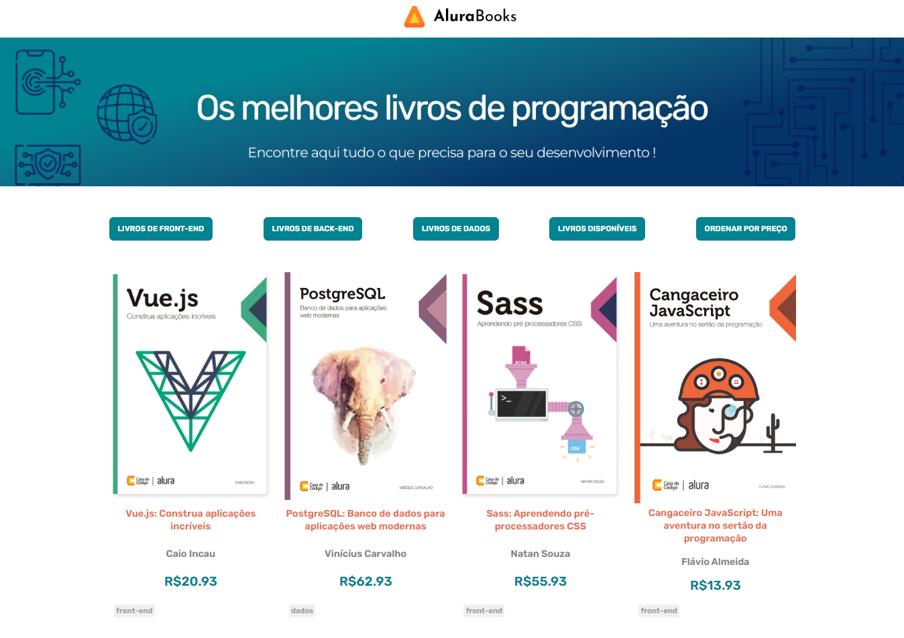

<h1> Alura Books </h1>

Projeto realizado durante a Formação Front End T6 - ONE Oracle + Alura

JavaScript: métodos de array

Nesse curso foi desenvolvido o Alura Books, um projeto para uma livraria virtual focada em programação.
Fiz algumas mudanças no design original como esquema de cores e fonte, também utilizei o Free Pik para criação de um novo banner.

Deploy: https://joanatav.github.io/aluraBooks-JoanaTav/ 

<h2>Preview 👀 </h2>

<h2>⚙️Tecnologias Utilizadas</h2>

